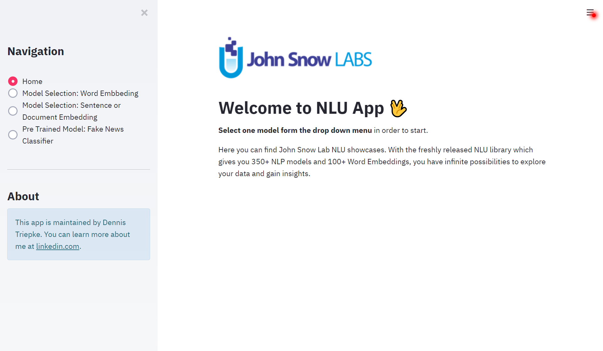
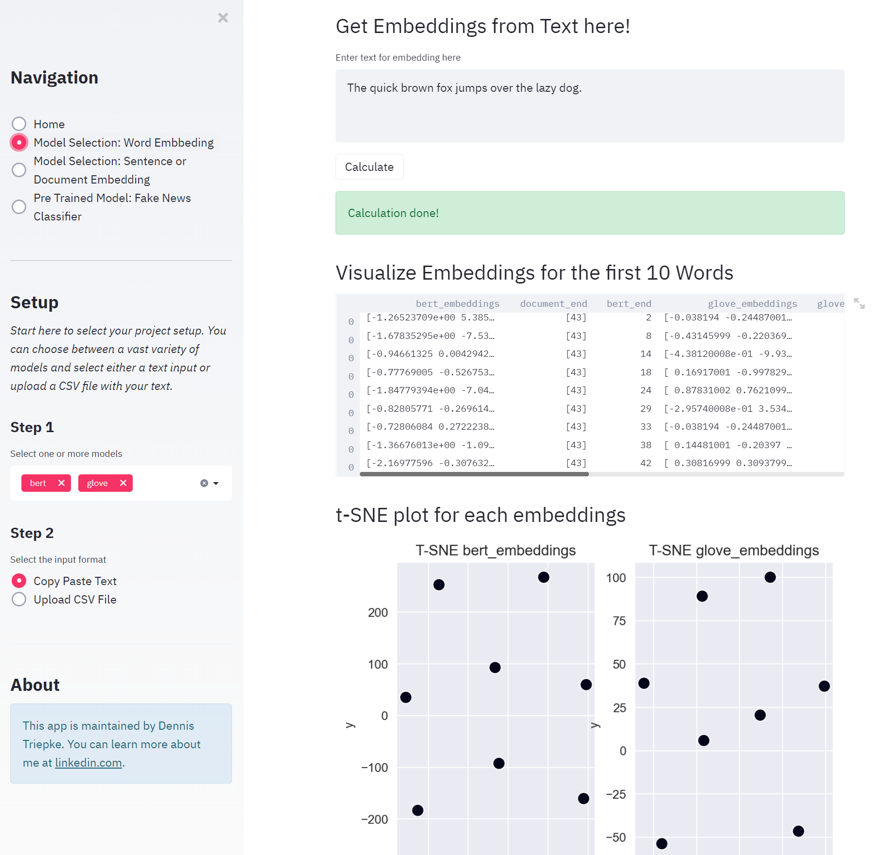
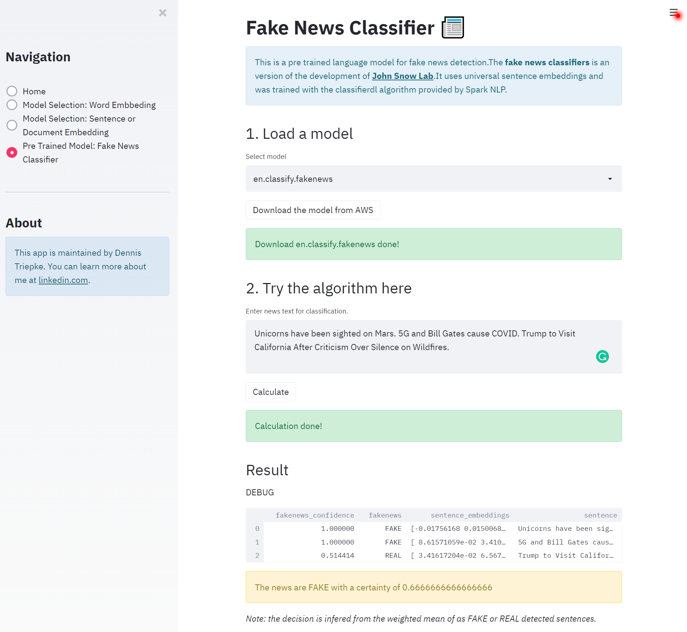

# Word Embedding with (John Snow Lab) NLU
 NLU has created a powerful API for embeddings (and even some NLP downstream-task like sarcasm detection or sentiment classification) in 1-liner of code. However, at the beginning of each NLP projects, you are facing the issue of selecting the model that fits best to your data structure. This app is designed for selecting and comparing pre-trained NLP models from NLU (John Snow Lab) with own data. Whether your project has word, sentence or document embeddings: upload the data, select some pre-trained models and download the embeddings. 



This app was build with [Streamlit](https://www.streamlit.io/) and has the sections:  

**Word embbeding**


**Sentance or Document embedding**


**Fake News Classifier**


# Get start on your local machine
Getting start with the description below on your go to [John White Lab Installation](https://nlu.johnsnowlabs.com/docs/en/install)

## 1. Java 8
You only need to configure Java 8 on your machine and are good to go! Unless you are on Windows, which requires 1 additional step.

* [Setup Java 8 on Windows](https://access.redhat.com/documentation/en-us/openjdk/8/html/getting_started_with_openjdk_8/getting_started_with_openjdk_for_windows)  
* [Setup Java 8 on Linux](https://openjdk.java.net/install/)
* [Setup Java 8 on Mac](https://docs.oracle.com/javase/8/docs/technotes/guides/install/mac_jdk.html)

Check you java version
```bash
$ java -version
# should be Java 8 (Oracle or OpenJDK)
```


## 2. Windows Specific Prerequisites
* Download [winutils.exe](https://github.com/steveloughran/winutils/blob/master/hadoop-2.7.1/bin/winutils.exe)
* Create folder C:\winutils\bin
* Copy winutils.exe inside C:\winutils\bin
* Set environment variable HADOOP_HOME to C:\winutils

## 3 Install NLU
Install `PySpark` based NLU form pip.  

*Note: For `nlu<=1.0.2` please use a Python version with version number SMALLER than 3.8* 

```bash
$ pip install nlu
```
 


# Credentials and links
* https://github.com/JohnSnowLabs/spark-nlp-workshop 
* https://www.johnsnowlabs.com/spark-nlp-in-action/
* https://www.streamlit.io/
* https://datascienceplus.com/